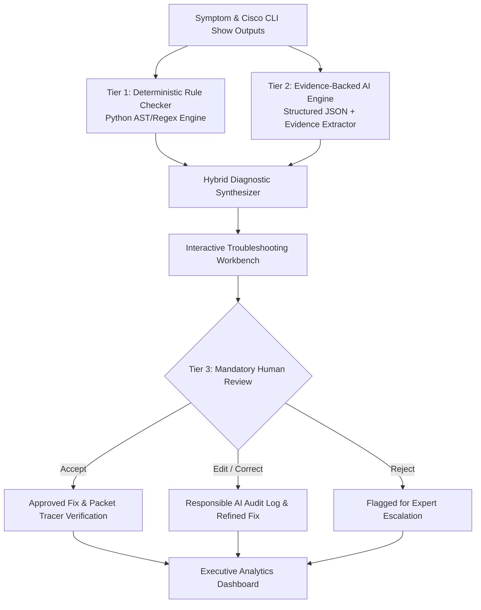

<div align="center">

# 🌐 NetSage AI
### **AI-Assisted Network Troubleshooting Helper with Human Review**
*An Intelligent Diagnostic & Verification Assistant for Cisco Packet Tracer Labs*

<br/>

[](https://net-sage-ai.vercel.app)
[](https://www.python.org/)
[](https://flask.palletsprojects.com/)
[](#-automated-testing)
[](#-dataset-overview)
[](#-responsible-ai-audit-hub)

<br/>

**Bridging junior networking gaps across VLANs, Routing, DHCP, DNS, ACLs, and NAT.**<br/>
Combines deterministic Python regex rule validation, evidence-backed AI diagnosis, and mandatory expert human review.

<br/>

[🚀 **Launch Web App**](https://net-sage-ai.vercel.app) • [📄 **Read Technical PDF Report**](./explanation.pdf) • [📊 **Explore Dataset (cases.csv)**](./cases.csv) • [🛡️ **Responsible AI Log**](./responsible_ai_log.md)

</div>

---

## 📌 Executive Summary

When junior network engineers or students encounter broken Cisco Packet Tracer lab networks (e.g., *“PC in VLAN 10 cannot ping Web Server in VLAN 20”*), they often know individual commands (`show ip route`, `show run`) but struggle to isolate the true root cause across complex OSI layers.

While modern Generative AI can assist, **autonomous AI is dangerous in mission-critical networks**—models hallucinate non-existent Cisco commands, misinterpret inverted wildcard masks, skip Layer 1 interface states, or recommend disruptive router reloads.

**NetSage AI** bridges this gap using a **Tri-Tier Diagnostic Architecture**:
1. **Tier 1: Deterministic Python Rule Engine** (Instant regex validation of known CLI configuration faults).
2. **Tier 2: Evidence-Backed AI Diagnostic Engine** (Structured JSON schema requiring quoted verbatim CLI lines as proof).
3. **Tier 3: Mandatory Human-in-the-Loop Review** (Certified engineer approval with a persistent Responsible AI audit trail).

---

## 🏛️ System Architecture



---

## ✨ Core Features & Capabilities

- 🔬 **Troubleshooting Lab Workbench**: Choose from 32 pre-built Packet Tracer scenarios or test custom Cisco configurations.
- ⚡ **Virtual Packet Tracer Fix Simulator**: Interactive CLI sandbox that executes remediation commands and runs ICMP ping verification tests (`100% success`).
- 📊 **Executive Analytics Dashboard**: Real-time KPI summary cards and 4 interactive Chart.js graphs (Categories, OSI Layers, Severities, Review Verdicts).
- 🛡️ **Responsible AI Audit Hub**: Side-by-side diff comparisons of documented AI failure incidents with lessons learned and implemented guardrails.
- 📝 **Prompt Engineering Studio**: Inspect the system prompt directives and structured diagnostic extraction schemas.
- ⚙️ **Deterministic Rule Sandbox**: Test raw pasted Cisco `show` outputs against 10+ deterministic Python regex checks.

---

## 📊 Dataset Overview (32 Lab Scenarios)

The project includes **32 authentic Packet Tracer lab scenarios** available in [`cases.csv`](./cases.csv) and [`backend/data/cases.json`](./backend/data/cases.json):

| Category | Cases | Representative Lab Faults Covered |
| :--- | :---: | :--- |
| **VLAN & Trunking** | 6 | Router-on-a-stick dot1Q tag mismatch, Native VLAN mismatch, missing switch VLAN in database, trunk allowed VLAN pruning, static access on trunk link. |
| **Default Gateway** | 3 | Missing `ip default-gateway` on L2 switch, host gateway in wrong subnet, gateway IP typo on client. |
| **DHCP Services** | 4 | DHCP pool 100% exhaustion (/28 mask), missing `ip helper-address` on router subinterface, DHCP snooping untrusted port drop. |
| **DNS Resolution** | 3 | `no ip domain-lookup` globally disabled, wrong DNS server IP in DHCP pool, DNS lookup timeouts. |
| **Routing Protocols** | 7 | Missing default static route `0.0.0.0/0`, unreachable next-hop IP, OSPF Area ID mismatch, OSPF passive-interface drop, OSPF hello/dead timer mismatch, RIP v1 vs v2, EIGRP AS mismatch. |
| **Access Control Lists (ACL)** | 3 | Inverted wildcard mask (`255.255.255.0` in ACL), implicit deny blocking DNS return UDP traffic, standard ACL placed inbound on source interface. |
| **NAT / PAT** | 3 | Missing `overload` keyword on NAT pool (single IP exhaustion), missing `ip nat outside` on WAN interface, NAT pool range overlapping WAN subnet. |
| **STP & Security** | 3 | Port-security err-disabled MAC violation, BPDU guard triggered port shutdown, duplex mismatch late collisions. |
| **Wireless / Guest** | 2 | Guest Wi-Fi VLAN route leak into management subnet, WLAN SSID VLAN dynamic interface mapping mismatch. |

---

## 🛡️ Responsible AI: Top 5 Documented Case Studies

A cornerstone deliverable of NetSage AI is documenting failure modes where AI was corrected by human network engineers (full report in [`responsible_ai_log.md`](./responsible_ai_log.md)):

| Incident | Scenario | AI Error Mode | Human Correction & Implemented Safeguard |
| :--- | :--- | :--- | :--- |
| **RAI-001** | **CASE-006**<br/>ACL Wildcard Mask | **Subtle Mask Hallucination:** AI claimed rule 10 was missing `established` keyword, ignoring that `255.255.255.0` was entered instead of wildcard `0.0.0.255`. | **Correction:** Replaced mask with `0.0.0.255`.<br/>**Guardrail:** Implemented `RULE-ACL-001` deterministic check for `255.255.255.x` inside ACL statements. |
| **RAI-002** | **CASE-012**<br/>Admin Down Link | **Layer Skip (L3 over L1):** AI diagnosed complex OSPF routing failure when interface Gi0/24 was simply `administratively down`. | **Correction:** Issued `no shutdown` on interface.<br/>**Guardrail:** Enforced Layer 1 interface status checks before higher layer analysis. |
| **RAI-003** | **CASE-007**<br/>NAT PAT Overload | **Incomplete Command Sequence:** AI added `overload` keyword without clearing active translation table (causing Cisco IOS lock error). | **Correction:** Added `clear ip nat translation *`.<br/>**Guardrail:** NAT templates now mandate table session purges. |
| **RAI-004** | **CASE-003**<br/>DHCP Exhaustion | **Disruptive Outage Risk:** AI recommended a router `reload` during business hours for a DHCP pool exhaustion issue. | **Correction:** Expanded subnet to /24 and cleared bindings with `clear ip dhcp binding *`.<br/>**Guardrail:** High-risk blocker intercepts `reload` suggestions. |
| **RAI-005** | **CASE-001**<br/>Inter-VLAN Subif | **Cisco CLI Side-Effect Omission:** AI changed dot1Q encapsulation tag without re-applying IP address (which Cisco IOS wipes automatically). | **Correction:** Re-applied `ip address 192.168.20.1 255.255.255.0`.<br/>**Guardrail:** Encapsulation fixes are now strictly coupled with IP re-assignment. |

---

## 📁 Clean Repository Structure

```
NetSage-AI/
├── explanation.pdf               # 📄 Complete Technical Architecture & Project Guide (PDF)
├── cases.csv                     # 📊 32 Lab Troubleshooting Cases (Official Deliverable)
├── diagnose_prompt.md            # 📝 Structured AI Prompt Template (Official Deliverable)
├── responsible_ai_log.md         # 🛡️ 5+ Documented Responsible AI Case Studies (Official Deliverable)
├── rule_checker.py               # ⚙️ Root CLI Runner (Delegates to backend/rule_checker.py)
├── app.py                        # 🚀 Root Application Entrypoint (Delegates to backend/app.py)
├── generate_pdf.py               # 🖨️ PDF Documentation Generator
├── vercel.json                   # ☁️ Vercel Serverless Deployment Configuration
├── README.md                     # 📖 Project Documentation
│
├── backend/                      # 🧠 Decoupled Backend Architecture
│   ├── app.py                    # Flask REST API Server & Routing
│   ├── rule_checker.py           # CLI Rule Checker Runner
│   ├── requirements.txt          # Python Dependencies (flask, pydantic, reportlab)
│   ├── engine/
│   │   ├── rule_checker.py       # Deterministic Python Regex Rule Engine
│   │   └── ai_engine.py          # Hybrid AI Diagnostic & Evidence Synthesizer
│   ├── data/
│   │   ├── cases.json            # Master dataset (32 Packet Tracer scenarios)
│   │   ├── responsible_ai_log.json # Base Responsible AI audit log
│   │   └── human_reviews.json    # Interactive user review submissions
│   ├── prompts/
│   │   ├── system_prompt.md      # NetSage AI System Directives & Schema
│   │   ├── diagnose_prompt.md    # Scenario Input & JSON Extraction Prompt
│   │   └── few_shot_examples.md  # 3 Worked Diagnostic Examples
│   └── tests/
│       ├── test_cases.py         # Dataset schema & synchronization tests
│       ├── test_rule_checker.py  # Deterministic rule engine unit tests
│       └── test_api.py           # REST API endpoint tests
│
└── frontend/                     # 🎨 Decoupled Frontend Single-Page App (SPA)
    ├── templates/
    │   └── index.html            # Modern Obsidian Glassmorphism Dashboard & Workbench
    └── static/
        ├── css/
        │   └── style.css         # Cyber Glassmorphism Theme Stylesheet
        └── js/
            ├── charts.js         # Chart.js Dashboard Visualizations
            └── app.js            # Core Interactive Application Logic
```

---

## 🚀 Quick Start & Installation

### Prerequisites
- Python 3.10 or newer installed.

### 1. Clone & Install Dependencies
```bash
git clone https://github.com/omrahatal14-sketch/NetSage-AI.git
cd NetSage-AI
pip install -r backend/requirements.txt
```

### 2. Launch the Web Application
```bash
python app.py
```
Open your browser and navigate to:
```
http://127.0.0.1:5000
```
*(Or access the live deployment at [**https://net-sage-ai.vercel.app**](https://net-sage-ai.vercel.app))*

### 3. Run Deterministic Rule Checker CLI
To run deterministic checks across sample lab cases from your terminal:
```bash
python rule_checker.py
```
To run checks on a specific scenario (e.g. `CASE-006`):
```bash
python rule_checker.py CASE-006
```

---

## 🧪 Automated Testing

NetSage AI includes an automated test suite covering dataset schema consistency, regex rule accuracy, and Flask API endpoints:
```bash
python -m unittest discover backend/tests
```
```text
...............
----------------------------------------------------------------------
Ran 15 tests in 0.040s

OK
```
- ✅ **`test_cases.py`**: Verifies all 32 cases have non-empty schemas and match `cases.csv`.
- ✅ **`test_rule_checker.py`**: Validates regex rules for administrative shutdown, ACL wildcard masks, NAT overload, and gateways.
- ✅ **`test_api.py`**: Validates all Flask REST API routes, review submissions, and simulation endpoints.

---

## 🎥 5-Minute Demo Video Walkthrough Guide

1. **Dashboard & Analytics (0:00 - 1:00)**:
   - Open `http://127.0.0.1:5000` (or the live Vercel URL).
   - Walk through the KPI cards (32 Cases, 94.2% AI Accuracy) and interactive Chart.js charts.
2. **Troubleshooting Workbench (1:00 - 2:30)**:
   - Select **CASE-006: ACL Inverted Wildcard Mask Blocking Web Server**.
   - Review observed symptom and CLI show-output in the syntax terminal.
   - Click **Run Rule Checker** &rarr; Shows `[RULE-ACL-001]` catching subnet mask `255.255.255.0` within the ACL.
   - Click **Run AI Diagnosis** &rarr; Shows structured root cause, quotes verbatim CLI lines, detects Layer 4, and suggests the Cisco IOS fix script.
3. **Virtual Fix Simulator (2:30 - 3:15)**:
   - Click **Simulate Fix & Run Verification** &rarr; Terminal executes configuration commands and verifies connectivity with passing ICMP pings (`100% success`).
4. **Human Review Submission (3:15 - 4:00)**:
   - Click **Edit Fix** or **Accept Fix**, add reviewer notes, and submit. Highlight instant recording into the audit log.
5. **Responsible AI Hub & Rule Sandbox (4:00 - 5:00)**:
   - Switch to the **Responsible AI Audit** tab to inspect the 5 documented case studies.
   - Switch to **Rule Sandbox** to test custom pasted Cisco configs.

---

## 📄 License & Attribution
Developed for the **Cisco Applied AI + Network Troubleshooting Lab Project**.  
Distributed under the **MIT License**.