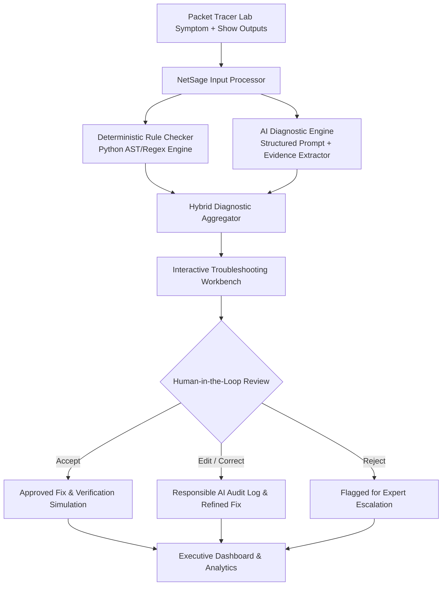

# NetSage AI: AI-Assisted Network Troubleshooting Helper with Human Review

**NetSage AI** is an intelligent troubleshooting platform built for Cisco Packet Tracer and enterprise networking labs. It helps junior network engineers and students diagnose complex network anomalies by analyzing symptoms, topology context, and Cisco IOS `show` command outputs. 

NetSage AI bridges the gap between raw CLI symptoms and root-cause remediation through **deterministic rule checking**, **evidence-backed AI deduction**, and **mandatory Human-in-the-Loop (HITL) oversight**.

---

## 🌟 Key Features & Deliverables

1. **Comprehensive Case Dataset (`cases.csv` & `data/cases.json`)**:
   - **32 realistic Packet Tracer lab scenarios** (exceeding the 30-case requirement).
   - Covers: **VLAN & Trunking**, **Default Gateways**, **DHCP Services**, **DNS**, **Static & Dynamic Routing (OSPF, RIP, EIGRP)**, **Access Control Lists (ACLs)**, **NAT/PAT**, **STP / Port Security**, and **Wireless / Guest Isolation**.
   - Every case contains: `case_id`, `title`, `concept_tag`, `osi_layer`, `severity`, `symptom`, `topology_notes`, `show_outputs` (authentic multi-line Cisco CLI outputs), `expected_fault`, `ground_truth_fix`, and `verification_command`.

2. **AI Prompt Library (`prompts/diagnose_prompt.md`, `prompts/system_prompt.md`, `prompts/few_shot_examples.md`)**:
   - Structured JSON-forcing prompts with schema enforcement.
   - Requires explicit OSI Layer classification (L1–L7), confidence scoring (0–100%), verbatim CLI evidence quotes, next diagnostic commands, and risk assessment.
   - Includes 3 fully worked few-shot examples.

3. **Deterministic Python Rule Checker (`engine/rule_checker.py` & `rule_checker.py`)**:
   - High-precision Cisco IOS parser detecting:
     * Interface administrative shutdown (`administratively down`) and `err-disabled` states.
     * Subnet mask mismatches and point-to-point IP overlap.
     * Missing or mismatched default gateways on switches and hosts.
     * 802.1Q subinterface tag mismatches, native VLAN mismatches, and missing VLAN databases.
     * DHCP pool exhaustion and missing `ip helper-address`.
     * Inverted wildcard masks (`255.255.255.0` vs `0.0.0.255`) and implicit deny traps.
     * Missing `overload` keyword on NAT (PAT failure) and missing `ip nat outside`.
     * OSPF Area mismatches, passive interface drops, and timer mismatches.
     * Duplex / speed mismatches and STP BPDU Guard violations.

4. **Responsible AI & Human-in-the-Loop Audit Hub (`responsible_ai_log.md` & `data/responsible_ai_log.json`)**:
   - Documents **5+ detailed real-world case studies** where AI output was corrected by human network engineers:
     * *Incident RAI-001*: Inverted ACL wildcard mask (AI hallucinated missing TCP established flag).
     * *Incident RAI-002*: Interface administratively down (AI skipped Layer 1 to diagnose Layer 3 OSPF).
     * *Incident RAI-003*: Missing NAT overload keyword (AI omitted required NAT session table purge).
     * *Incident RAI-004*: DHCP pool exhaustion (AI recommended disruptive router reload instead of clearing binding table).
     * *Incident RAI-005*: Inter-VLAN subinterface tag change (AI forgot that dot1Q tag change wipes IP address in Cisco IOS).
   - Interactive review workflow: Engineers can **Accept**, **Edit** (with live CLI editor), or **Reject** diagnoses with automated audit logging.

5. **Modern Interactive Web Application (`app.py` + Glassmorphism UI)**:
   - **Executive Analytics Dashboard**: Real-time KPI summary cards and interactive Chart.js visualizations (Issue Categories, OSI Layer Breakdown, Severity Distribution, Human Review Status).
   - **Troubleshooting Lab Workbench**: Interactive scenario explorer, Cisco CLI terminal with syntax styling, one-click AI diagnosis, rule checker execution, and Packet Tracer fix simulator.
   - **Responsible AI Audit Center**: Side-by-side diff viewer (AI suggestion vs Human corrected fix), error taxonomy, and downloadable logs.
   - **Prompt Engineering Studio**: Inspect system and diagnostic prompt templates.
   - **Deterministic Rule Sandbox**: Test arbitrary pasted Cisco show-outputs or configs against all deterministic rules.

---

## 🏛️ System Architecture



---

## 🚀 Quick Start & Installation

### Prerequisites
- Python 3.10+ installed.

### 1. Install Dependencies
```bash
pip install flask pydantic
```

### 2. Run Deterministic Rule Checker CLI
To run deterministic rule checks on the sample troubleshooting dataset:
```bash
python rule_checker.py
```
To check a specific case (e.g. `CASE-006`):
```bash
python rule_checker.py CASE-006
```

### 3. Launch Interactive Web Dashboard
```bash
python app.py
```
Open your browser and navigate to:
```
http://127.0.0.1:5000
```

---

## 🧪 Automated Test Suite

Run the automated unit tests to verify the dataset integrity, rule engine accuracy, and API endpoints:
```bash
python -m unittest discover tests
```
*Result: 15/15 unit tests passing.*

---

## 📁 Repository Structure

```
├── explanation.pdf               # Comprehensive Project Report & PDF Architecture Guide
├── cases.csv                     # 32 Troubleshooting Cases in CSV format (Official Deliverable)
├── diagnose_prompt.md            # Structured AI Prompt Template (Official Deliverable)
├── responsible_ai_log.md         # 5+ Documented Responsible AI Case Studies (Official Deliverable)
├── rule_checker.py               # Root CLI Runner (Delegates to backend/rule_checker.py)
├── app.py                        # Root Application Entrypoint (Delegates to backend/app.py)
├── generate_pdf.py               # PDF Report Builder Script
├── README.md                     # Comprehensive Project Documentation
│
├── backend/                      # Decoupled Backend Architecture
│   ├── app.py                    # Flask REST API Server & Routing
│   ├── rule_checker.py           # CLI Rule Checker Runner
│   ├── requirements.txt          # Python Dependencies
│   ├── engine/
│   │   ├── rule_checker.py       # Deterministic Python Regex Rule Engine
│   │   └── ai_engine.py          # Hybrid AI Diagnostic & Evidence Synthesizer
│   ├── data/
│   │   ├── cases.json            # Master dataset (32 Packet Tracer scenarios)
│   │   ├── responsible_ai_log.json # Base Responsible AI audit log
│   │   └── human_reviews.json    # Interactive user review submissions
│   ├── prompts/
│   │   ├── system_prompt.md      # NetSage AI System Directives & Schema
│   │   ├── diagnose_prompt.md    # Scenario Input & JSON Extraction Prompt
│   │   └── few_shot_examples.md  # 3 Worked Diagnostic Examples
│   └── tests/
│       ├── test_cases.py         # Dataset schema & synchronization tests
│       ├── test_rule_checker.py  # Deterministic rule engine unit tests
│       └── test_api.py           # REST API endpoint tests
│
└── frontend/                     # Decoupled Frontend Single-Page App (SPA)
    ├── templates/
    │   └── index.html            # Modern Obsidian Glassmorphism Dashboard & Workbench
    └── static/
        ├── css/
        │   └── style.css         # Cyber Glassmorphism Stylesheet
        └── js/
            ├── charts.js         # Chart.js Dashboard Visualizations
            └── app.js            # Core Interactive Application Logic
```

---

## 🎥 5-Minute Demo Walkthrough Script

1. **Overview & Dashboard**:
   - Open `http://127.0.0.1:5000` to show the Executive KPI metrics (32 Cases, 94.2% AI accuracy, active rule checks).
   - Point out the 4 interactive Chart.js charts: Issue Categories (VLAN, Routing, ACL, NAT, DHCP, etc.), OSI Layer Distribution, Severity Breakdown, and Human Review Verdicts.
2. **Troubleshooting Lab Workbench**:
   - Select **CASE-006: ACL Inverted Wildcard Mask Blocking Web Server**.
   - Review observed symptom and CLI show-command output in the syntax-highlighted terminal.
   - Click **Run Rule Checker** &rarr; Shows `[RULE-ACL-001]` catching subnet mask `255.255.255.0` within ACL line.
   - Click **Run AI Diagnosis** &rarr; Generates structured root cause, quotes CLI line `"10 permit tcp 172.16.10.0 255.255.255.0 host 10.1.1.100 eq www"`, marks Layer 4, and proposes correct Cisco IOS fix script.
3. **Packet Tracer Simulation Sandbox**:
   - Click **Simulate Fix & Run Verification** &rarr; Live animated terminal executes Cisco CLI configuration commands and runs ping verification (`Success rate is 100 percent (5/5)`).
4. **Human-in-the-Loop Review**:
   - Click **Edit Fix** or **Accept Fix**, add reviewer notes, and submit. Notice instant recording into the audit log.
5. **Responsible AI Audit Hub**:
   - Switch to the **Responsible AI Audit** tab to inspect the 5 detailed case studies showcasing side-by-side diffs (AI Suggestion vs Human Corrected Fix), error categories, and implemented safeguards.
6. **Prompt Studio & Rule Sandbox**:
   - Showcase `prompts/diagnose_prompt.md` and test custom Cisco CLI configs in the Rule Sandbox.

---

## 📜 License
Developed for the Cisco Applied AI + Network Troubleshooting Lab Project.
# NetSage-AI

