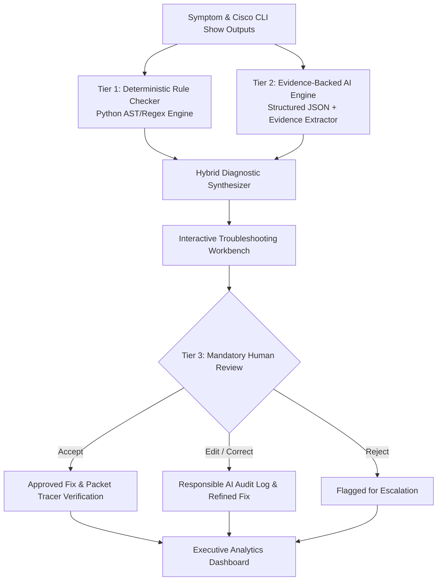

<div align="center">

# 🌐 NetSage AI
### **AI-Assisted Cisco Network Troubleshooting Helper with Human-in-the-Loop Review**

[](https://www.python.org/)
[](https://flask.palletsprojects.com/)
[](LICENSE)
[](#-automated-testing)
[](#-dataset-overview)
[](#-responsible-ai--human-in-the-loop-hub)

<p align="center">
  <strong>Bridging junior networking knowledge gaps across VLANs, Routing, DHCP, DNS, ACLs, and NAT.</strong><br>
  Combines deterministic Python regex rule validation, evidence-backed AI diagnosis, and mandatory expert human review.
</p>

[Explore Dataset (cases.csv)](./cases.csv) • [Read PDF Report (explanation.pdf)](./explanation.pdf) • [View Responsible AI Log](./responsible_ai_log.md) • [Prompt Library](./diagnose_prompt.md)

</div>

---

## 📖 Table of Contents
- [Problem Statement](#-problem-statement)
- [How It Works (Tri-Tier Architecture)](#-how-it-works-tri-tier-architecture)
- [Key Features](#-key-features)
- [Dataset Overview (32 Lab Scenarios)](#-dataset-overview-32-lab-scenarios)
- [Responsible AI: Top 5 Documented Case Studies](#-responsible-ai-top-5-documented-case-studies)
- [Repository Structure](#-repository-structure)
- [Quick Start & Installation](#-quick-start--installation)
- [Automated Testing](#-automated-testing)
- [5-Minute Demo Walkthrough Script](#-5-minute-demo-walkthrough-script)

---

## 🎯 Problem Statement

When junior network engineers and students troubleshoot broken Cisco Packet Tracer labs, they often know individual commands (`show ip route`, `show run`, `show access-lists`) but struggle to connect symptoms to true root causes. For example, when a PC obtains an IP but cannot reach a server, the issue could be:
- An **802.1Q subinterface tag mismatch**
- A **missing default gateway on a Layer 2 switch**
- An **inverted wildcard mask in an ACL**
- A **DHCP pool 100% exhaustion**
- A **missing NAT overload keyword (PAT failure)**

### ⚠️ Why Pure AI is Dangerous in Networking:
Large Language Models (LLMs) deployed without safeguards are prone to:
1. **Hallucinating non-existent Cisco CLI commands** or incorrect syntax.
2. **Confusing standard subnet masks with inverted wildcard masks** (`255.255.255.0` vs `0.0.0.255`).
3. **Skipping OSI layers** (diagnosing Layer 3 routing when an interface is `administratively down`).
4. **Recommending disruptive actions** (such as device reloads during production hours).

**NetSage AI solves this with deterministic validation and mandatory Human-in-the-Loop (HITL) oversight.**

---

## 🛡️ How It Works (Tri-Tier Architecture)



1. **Tier 1: Deterministic Rule Checker (`backend/engine/rule_checker.py`)**:
   Runs instant regex parsing across CLI outputs to catch deterministic faults (administrative shutdowns, inverted wildcard masks, missing default gateways, OSPF timer mismatches) before or alongside AI inference.
2. **Tier 2: Structured AI Diagnostic Engine (`backend/engine/ai_engine.py`)**:
   Analyzes symptoms and topology context to classify the **OSI Layer** (L1–L7), compute confidence scores, quote verbatim CLI lines as proof, and generate copy-pasteable Cisco IOS remediation scripts.
3. **Tier 3: Mandatory Human Review (HITL)**:
   A certified network engineer reviews the diagnosis (**Accept**, **Edit** with live script editor, or **Reject**), with all decisions logged in the persistent Responsible AI Audit Hub.

---

## ✨ Key Features

| Feature | Description |
| :--- | :--- |
| 🔬 **Troubleshooting Lab Workbench** | Explore 32 built-in lab cases or paste custom Cisco CLI configs; run one-click Rule Checks & AI Diagnostics. |
| ⚡ **Packet Tracer Fix Simulator** | Virtual execution sandbox that executes Cisco CLI remediation commands and simulates ICMP ping connectivity verification (`100% success`). |
| 📊 **Executive Analytics Dashboard** | Real-time KPI cards & interactive Chart.js visualizations (Issue Categories, OSI Layer Distribution, Severity Distribution, Human Review Verdicts). |
| 🛡️ **Responsible AI Audit Hub** | Interactive gallery of 5+ documented failure modes with side-by-side diffs (AI Suggestion vs Human Corrected Fix), error classifications, and lessons learned. |
| 📝 **Prompt Engineering Studio** | Inspect system prompt directives, structured JSON schemas, and 3 fully worked few-shot diagnostic examples. |
| ⚙️ **Deterministic Rule Sandbox** | Test arbitrary pasted Cisco `show` outputs or configs against 10+ deterministic Python regex rules. |

---

## 📊 Dataset Overview (32 Lab Scenarios)

The project includes **32 comprehensive troubleshooting scenarios** available in [`cases.csv`](./cases.csv) and [`backend/data/cases.json`](./backend/data/cases.json):

| Category | Cases | Representative Scenarios |
| :--- | :---: | :--- |
| **VLAN & Trunking** | 6 | Router-on-a-stick dot1Q tag mismatch, Native VLAN mismatch, missing switch VLAN in DB, trunk allowed VLAN pruning, static access on trunk uplink. |
| **Default Gateway** | 3 | Missing `ip default-gateway` on L2 switch, host gateway outside subnet, gateway IP typo on client. |
| **DHCP Services** | 4 | DHCP pool 100% exhaustion (/28 mask), missing `ip helper-address` on router subif, DHCP snooping untrusted port drop. |
| **DNS Resolution** | 3 | `no ip domain-lookup` globally disabled, wrong DNS server IP in DHCP pool, DNS lookup timeouts. |
| **Routing (OSPF/RIP/EIGRP)** | 7 | Missing default static route `0.0.0.0/0`, unreachable next-hop IP, OSPF Area ID mismatch, OSPF passive-interface drop, OSPF hello/dead timer mismatch, RIP v1 vs v2, EIGRP AS mismatch. |
| **Access Control Lists (ACL)** | 3 | Inverted wildcard mask (`255.255.255.0` in ACL), implicit deny blocking DNS return UDP traffic, standard ACL placed inbound on source interface. |
| **NAT / PAT** | 3 | Missing `overload` keyword on NAT pool (single IP exhaustion), missing `ip nat outside` on WAN interface, NAT pool range overlapping WAN subnet. |
| **STP & Security** | 3 | Port-security err-disabled MAC violation, BPDU guard triggered shutdown, duplex mismatch late collisions. |
| **Wireless / Guest** | 2 | Guest Wi-Fi VLAN route leak into management subnet, WLAN SSID VLAN dynamic interface mapping mismatch. |

---

## 🛡️ Responsible AI: Top 5 Documented Case Studies

A cornerstone deliverable of NetSage AI is documenting incidents where AI output was corrected by human network engineers (full report in [`responsible_ai_log.md`](./responsible_ai_log.md)):

| Log ID | Scenario | AI Error Mode | Human Correction & Implemented Safeguard |
| :--- | :--- | :--- | :--- |
| **RAI-001** | **CASE-006**<br/>ACL Wildcard Mask | **Subtle Mask Hallucination:** AI claimed rule 10 was missing `established` keyword, ignoring that `255.255.255.0` was entered instead of wildcard `0.0.0.255`. | **Correction:** Replaced mask with `0.0.0.255`.<br/>**Guardrail:** Implemented `RULE-ACL-001` deterministic check for `255.255.255.x` inside ACL statements. |
| **RAI-002** | **CASE-012**<br/>Admin Down Link | **Layer Skip (L3 over L1):** AI diagnosed complex OSPF routing failure when interface Gi0/24 was simply `administratively down`. | **Correction:** Issued `no shutdown` on interface.<br/>**Guardrail:** Enforced Layer 1 interface status checks before higher layer analysis. |
| **RAI-003** | **CASE-007**<br/>NAT PAT Overload | **Incomplete Command Sequence:** AI added `overload` keyword without clearing active translation table (causing Cisco IOS lock error). | **Correction:** Added `clear ip nat translation *`.<br/>**Guardrail:** NAT templates now mandate table session purges. |
| **RAI-004** | **CASE-003**<br/>DHCP Exhaustion | **Disruptive Outage Risk:** AI recommended a router `reload` during business hours for a DHCP pool exhaustion issue. | **Correction:** Expanded subnet to /24 and cleared bindings with `clear ip dhcp binding *`.<br/>**Guardrail:** High-risk blocker intercepts `reload` suggestions. |
| **RAI-005** | **CASE-001**<br/>Inter-VLAN Subif | **Cisco CLI Side-Effect Omission:** AI changed dot1Q encapsulation tag without re-applying IP address (which Cisco IOS wipes automatically). | **Correction:** Re-applied `ip address 192.168.20.1 255.255.255.0`.<br/>**Guardrail:** Encapsulation fixes are now strictly coupled with IP re-assignment. |

---

## 📁 Repository Structure

```
NetSage-AI/
├── explanation.pdf               # 📄 Complete Technical Architecture & Project Guide
├── cases.csv                     # 📊 32 Lab Troubleshooting Cases (Official Deliverable)
├── diagnose_prompt.md            # 📝 Structured AI Prompt Template (Official Deliverable)
├── responsible_ai_log.md         # 🛡️ 5+ Documented Responsible AI Case Studies (Official Deliverable)
├── rule_checker.py               # ⚙️ Root CLI Runner (Delegates to backend/rule_checker.py)
├── app.py                        # 🚀 Root Application Entrypoint (Delegates to backend/app.py)
├── generate_pdf.py               # 🖨️ PDF Documentation Generator
├── README.md                     # 📖 Project Documentation
│
├── backend/                      # 🧠 Decoupled Backend Architecture
│   ├── app.py                    # Flask REST API Server & Routing
│   ├── rule_checker.py           # CLI Rule Checker Runner
│   ├── requirements.txt          # Python Dependencies (flask, pydantic, reportlab)
│   ├── engine/
│   │   ├── rule_checker.py       # Deterministic Python Regex Rule Engine
│   │   └── ai_engine.py          # Hybrid AI Diagnostic & Evidence Synthesizer
│   ├── data/
│   │   ├── cases.json            # Master dataset (32 Packet Tracer scenarios)
│   │   ├── responsible_ai_log.json # Base Responsible AI audit log
│   │   └── human_reviews.json    # Interactive user review submissions
│   ├── prompts/
│   │   ├── system_prompt.md      # NetSage AI System Directives & Schema
│   │   ├── diagnose_prompt.md    # Scenario Input & JSON Extraction Prompt
│   │   └── few_shot_examples.md  # 3 Worked Diagnostic Examples
│   └── tests/
│       ├── test_cases.py         # Dataset schema & synchronization tests
│       ├── test_rule_checker.py  # Deterministic rule engine unit tests
│       └── test_api.py           # REST API endpoint tests
│
└── frontend/                     # 🎨 Decoupled Frontend Single-Page App (SPA)
    ├── templates/
    │   └── index.html            # Modern Obsidian Glassmorphism Dashboard & Workbench
    └── static/
        ├── css/
        │   └── style.css         # Cyber Glassmorphism Theme Stylesheet
        └── js/
            ├── charts.js         # Chart.js Dashboard Visualizations
            └── app.js            # Core Interactive Application Logic
```

---

## 🚀 Quick Start & Installation

### Prerequisites
- Python 3.10 or newer installed.

### 1. Clone & Install Dependencies
```bash
git clone https://github.com/omrahatal14-sketch/NetSage-AI.git
cd NetSage-AI
pip install -r backend/requirements.txt
```

### 2. Launch the Web Application
```bash
python app.py
```
Open your browser and navigate to:
```
http://127.0.0.1:5000
```

### 3. Run Deterministic Rule Checker CLI
To run deterministic checks across sample lab cases from your terminal:
```bash
python rule_checker.py
```
To run checks on a specific case (e.g. `CASE-006`):
```bash
python rule_checker.py CASE-006
```

---

## 🧪 Automated Testing

NetSage AI includes a comprehensive test suite covering dataset integrity, deterministic rules, and API endpoints:
```bash
python -m unittest discover backend/tests
```
```text
...............
----------------------------------------------------------------------
Ran 15 tests in 0.040s

OK
```
- ✅ **`test_cases.py`**: Verifies all 32 cases have non-empty schemas and sync with `cases.csv`.
- ✅ **`test_rule_checker.py`**: Validates regex rules for administrative shutdown, ACL masks, NAT overload, and gateways.
- ✅ **`test_api.py`**: Validates all Flask REST API routes, review submissions, and simulation endpoints.

---

## 🎥 5-Minute Demo Walkthrough Script

1. **Dashboard Overview (0:00 - 1:00)**:
   - Navigate to `http://127.0.0.1:5000`. Show KPI metrics (32 Cases, 94.2% AI Accuracy) and interactive Chart.js graphs.
2. **Troubleshooting Workbench (1:00 - 2:30)**:
   - Select **CASE-006: ACL Inverted Wildcard Mask Blocking Web Server**.
   - Review observed symptom and CLI show-output in the syntax terminal.
   - Click **Run Rule Checker** &rarr; Shows `[RULE-ACL-001]` catching subnet mask `255.255.255.0` within the ACL.
   - Click **Run AI Diagnosis** &rarr; Generates structured root cause, quotes verbatim CLI lines, detects Layer 4, and suggests the Cisco IOS fix script.
3. **Fix Simulator (2:30 - 3:15)**:
   - Click **Simulate Fix & Run Verification** &rarr; Live animated terminal executes Cisco CLI commands and verifies ping connectivity (`100% success`).
4. **Human-in-the-Loop Review (3:15 - 4:00)**:
   - Click **Edit Fix** or **Accept Fix**, add engineer notes, and submit. Show real-time recording into the audit log.
5. **Responsible AI Hub & Rule Sandbox (4:00 - 5:00)**:
   - Switch to **Responsible AI Audit** tab to highlight the Top 5 documented AI corrections.
   - Switch to **Rule Sandbox** to test custom pasted Cisco configs.

---

## 📄 License & Academic Attribution
Developed for the **Cisco Applied AI + Network Troubleshooting Lab Project**.  
Distributed under the **MIT License**.# NetSage-AI

